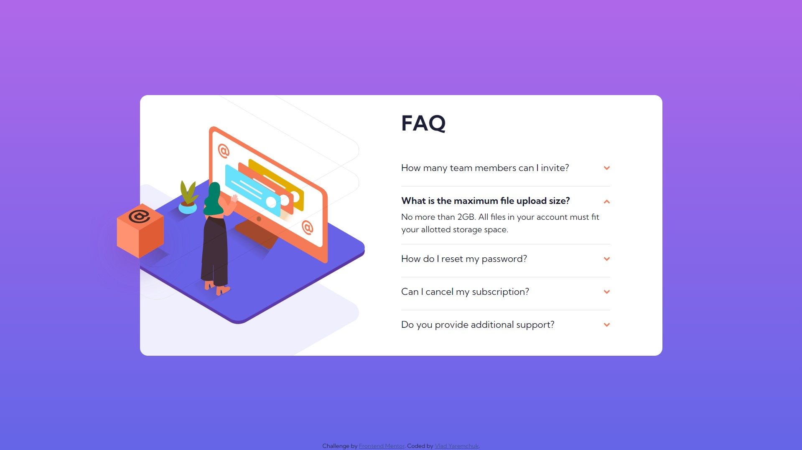

# Frontend Mentor - FAQ accordion card solution

This is a solution to the [FAQ accordion card challenge on Frontend Mentor](https://www.frontendmentor.io/challenges/faq-accordion-card-XlyjD0Oam). Frontend Mentor challenges help you improve your coding skills by building realistic projects. 

## Table of contents

- [Overview](#overview)
  - [The challenge](#the-challenge)
  - [Screenshot](#screenshot)
  - [Links](#links)
- [My process](#my-process)
  - [Built with](#built-with)
  - [What I learned](#what-i-learned)
  - [Continued development](#continued-development)

## Overview

### The challenge

Users should be able to:

- View the optimal layout for the component depending on their device's screen size
- See hover states for all interactive elements on the page
- Hide/Show the answer to a question when the question is clicked

### Screenshot




### Links

- Solution URL: [Add solution URL here](https://your-solution-url.com)
- Live Site URL: [https://vladmidir.github.io/accordion-card-react/](https://vladmidir.github.io/accordion-card-react/)

## My process

### Built with

- Semantic HTML5 markup
- CSS custom properties
- [React](https://reactjs.org/) - JS library


### What I learned

Learned how to build components with React.
```js
const MyComponent = ({text}) => {
  return (<div>
    <h2>Title</h2>
    <p>Paragraph: {text}</p>
  </div>)
}
```
Learned how to use map() to build components from an array of data.
```js
//use id as a key
{ accordionData.map(({id, title, body}) => (
    <Accoridion key={id} title={title} body={body} />
  ))}
```
Learned about React hooks.
```js
const [isActive, setIsActive] = useState(false)
```
Learned how to style multiple background images with CSS.
```css
main {
  background-image: url('../public/images/bg-pattern-desktop.svg'), url('../public/images/illustration-woman-online-desktop.svg');
  background-size: 80% , 50%;
  background-repeat: no-repeat;
  background-position: -380px , -70px;
}
```
Learned how to deploy React apps to GitHub pages.

### Continued development

One thing I struggled with is deployment. I want to learn how to structure my React project properly, so I 
don't run into problems when deploying it.

Also, I want to redo the interatice-credit-card-form with React.

### Useful resources

- [How to Build React Accordion](https://www.freecodecamp.org/news/build-accordion-menu-in-react-without-external-libraries/) - This helped to build the FAQ accordion.
- [Intro to React Hooks](https://levelup.gitconnected.com/an-introduction-to-react-hooks-50281fd961fe) - This article helped me understand React hooks.

## Author

- Frontend Mentor - [@Vladmidir](https://www.frontendmentor.io/profile/Vladmidir)
